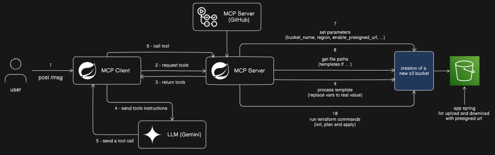

## Powered By

- [Spring Boot](https://spring.io/projects/spring-boot)
- [Spring AI (MCP Server)](https://docs.spring.io/spring-ai/reference/api/mcp/mcp-overview.html)
- [Terraform](https://www.terraform.io/)
- LLMs
- Amazon Web Services

## References

This project was inspired by [Pedro Carrijo](https://gitlab.com/pedrocarrijo), creator of [MultiCloudInfraAI](https://gitlab.com/pedrocarrijo/MultiCloudInfraAI), a platform that integrates AI, Terraform, and multi-cloud provisioning into a single, extensible solution.
